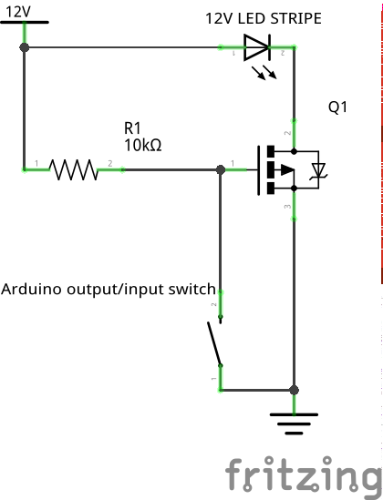

# PWMDDIRLib
PWM library for arduino.

It's actually 2 libraries in 1:
* Switching data direction instead of voltage level
* Normal HIGH/LOW switching of ports
* Mixing is of those 2 modes of operation os currently not supported

Note: My electronic skills are "low" - use this library with care (aka you are reponsible for the consequences, not me).

Allows PWM signals with higher voltages than the arduino can supply. 
If you, like me, bought some non TTL level MOSFETs but you have a higher volatage available in your circuit (like 12V) you can use this library to trigger the MOSFET with 12V.

See  on how to conenct your hardware to use this library.
